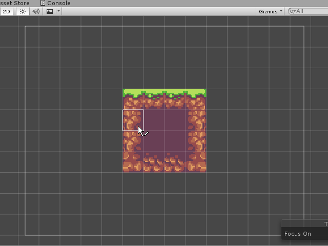

# LibGDX Auto-tiling System
Adds Unity's Rule Tile functionality to LibGDX. Allows you to define which image the tile should be based on which neighbors it has. Use this however you want idk how copyright works.

